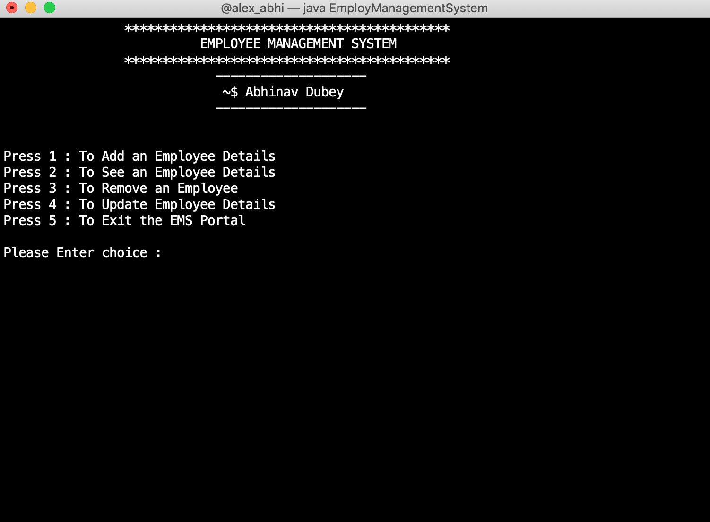

# Employee-Management-System
This repository consists of Java Program for Employee Management System. In this repository I have created a TUI program for Employee Management System which consists of 4 different operation. 
(1) Adding User   (2) Removing User  (3) Updating User   (4) Viewing details of User

The Program is completely based on OOPs concept.

# How to run ?
For Compliation : <code>javac EmployManagementSystem.java</code>

To Run Program  : <code>java EmployManagementSystem</code>
